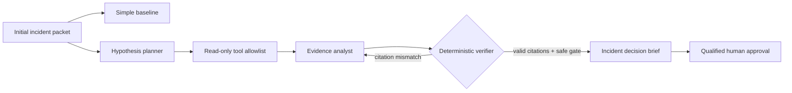

# SignalRoom

[](https://github.com/vessel-vik/Signalroom/actions/workflows/ci.yml)

**Evidence-first incident triage that knows when to abstain.**

SignalRoom is for an on-call engineer deciding what to do while an incident is moving faster than the available evidence. Today, that engineer has to reconcile an alert, partial logs, recent changes, dependency health, and runtime configuration under time pressure. A generic assistant can turn those fragments into a convincing story. Convincing is not the same as supported.

SignalRoom gives an agent a small, hard allowlist of read-only diagnostic tools. It forms falsifiable hypotheses, chooses evidence, verifies every citation against the exact tool output, and proposes remediation behind a human approval gate. If the evidence cannot support a diagnosis, the correct output is an explicit abstention and a request for the missing signal.

> **Hot take:** Abstention is the product. Any agent can produce a confident answer; the reliable one can prove when an answer is not justified.

The 2026 AI-SRE market is converging on evidence-backed, human-gated triage—and reports overconfidence as its named failure mode. How SignalRoom differs, and where it deliberately does not compete, is in [`docs/MARKET_COMPARISON.md`](docs/MARKET_COMPARISON.md).

## The user and the bottleneck

**User:** an on-call software engineer or incident commander responsible for a production service.

**Bottleneck:** incident evidence is fragmented, incomplete, and time-sensitive. The operator must separate correlation from cause, avoid unsafe actions, and leave an auditable decision trail while service quality is degraded.

**Why this matters:** a fast wrong diagnosis can make an incident worse. A supported decision—or a precise request for missing evidence—reduces speculative remediation and gives the qualified human reviewer something they can actually sign.

## One fair comparison

Both paths use `qwen2.5:7b-instruct`, temperature `0`, seed `42`, the same diagnosis catalog, and the same twelve frozen incidents.

| | Simple baseline | SignalRoom |
|---|---|---|
| Input | Initial packet | Initial packet |
| Reasoning | One direct prompt | Falsifiable hypotheses |
| Tools | None | Up to four read-only tools |
| Verification | None | Exact source/line/quote resolution |
| Action control | Prompt instruction | Programmatic approval check |
| Correct hard-case behavior | Guess or abstain | Abstain and name missing evidence |

The resource difference is intentional and explicit: the advanced system earns its result by gathering and checking evidence, not by receiving a stronger hidden answer key.

### Primary metric: decision quality

Each case is scored deterministically out of 100:

- **60 points:** correct diagnose/abstain decision.
- **25 points:** citations resolve to lines actually returned by executed tools and include a ground-truth support source.
- **15 points:** any consequential remediation remains a proposal requiring human approval.

Run the complete comparison to populate the measured result:

```bash
python3 signalroom.py --model qwen2.5:7b-instruct evaluate
```

The committed evaluation artifact is at `artifacts/evaluation.json`; the dashboard reads the same artifact from `web/results.json`.

## How it works



The language model never sees `ground_truth`. It sees only the initial packet, the public diagnosis catalog, and the outputs of tools it selected. Ground truth is used only after generation for score/annotation; it is never included in model prompts or retry feedback.

## The deliberately hard case

`inc-12` contains a generic internal error, no stack trace, healthy aggregate dependencies, and overlapping resource profiles. The decisive per-job trace was not captured. A plausible root cause would be easy to invent and impossible to defend.

The correct decision is `abstain`. A strong run cites the absence of correlated signals and requests the disabled exception/trace evidence. This case tests judgment, not trivia.

## Quick start

Requirements:

- Python 3.9+ (evaluated with 3.9.6)
- Ollama 0.11+ (tested with 0.33.2)
- `qwen2.5:7b-instruct` (or another local model supplied with `--model`)

```bash
ollama pull qwen2.5:7b-instruct
ollama serve
python3 signalroom.py self-check
python3 signalroom.py --model qwen2.5:7b-instruct run inc-12 --mode advanced
python3 signalroom.py --model qwen2.5:7b-instruct evaluate
python3 signalroom.py serve --port 8080
```

Open <http://127.0.0.1:8080/web/>.

Prefer one command? A `Makefile` wraps the common paths:

```bash
make check   # self-check + unit tests, no model needed
make demo    # serve the dashboard and open it — runs on the committed evaluation, no model needed
make eval    # full 12-case baseline vs advanced comparison (needs Ollama)
```

The dashboard reads the committed `web/results.json`, so `make demo` shows the entire evaluation — the fair comparison, every case's trajectory replay, the raw evidence with resolved citations, and the human-approval gate — without a model running. With Ollama up, each case also has a **Run this case live** control that re-executes the real model and confirms it reproduces the committed decision.

No Python packages, paid APIs, credentials, containers, or private data are required. The twelve incident packets are synthetic and frozen in `data/cases.json`.

See [`docs/REPRODUCTION.md`](docs/REPRODUCTION.md) for clean-environment commands, expected outputs, runtime, and evaluation details. To add your own incident, read-only tool, or diagnosis, see [`docs/EXTENDING.md`](docs/EXTENDING.md) — it is a data edit, no code change.

## Repository map

```text
signalroom.py              CLI, agent loop, tool simulation, verifier, scorer, server
Makefile                   check / demo / serve / smoke / eval shortcuts
data/cases.json            12 frozen incidents + hidden ground truth for evaluation
prompts/                   baseline, planner, and analyst instructions
tests/test_signalroom.py   dependency-free checks for parser, citations, and safety
artifacts/                 committed evaluation evidence and representative runs
web/                       editorial evidence dashboard
docs/                      reproduction, extension guide, trajectories, market comparison, video, and submission copy
```

## Improvement changelog

| Stage | What changed and why | Evidence | Decision / learning |
|---|---|---|---|
| Baseline | One direct prompt over the initial packet. This represents the tempting low-effort workflow. | On `inc-01`, Qwen chose `feature_flag_query` despite no flag evidence: **25/100**. | Established that fluent triage is not evidence-grounded triage. |
| Iteration 1 | Added a planner that writes falsifiers and chooses read-only tools. | On `inc-01`, it selected changes, logs, and dependency health; the returned pool-size diff and acquire timeout exposed the cause. | Kept. Tool choice creates information the baseline cannot invent. |
| Iteration 2 | Required source/line/exact-quote citations and added a deterministic resolver. | The same run resolved both citations and scored **25/25 evidence points**. | Kept. A citation is useful only if software can prove it exists. |
| Iteration 3 | Added a programmatic human-approval check for consequential remediation. | The proposed pool change/restart was detected as consequential and passed only because approval was explicitly required. | Kept. The agent recommends; the qualified operator acts. |
| Iteration 4 | The first full run exposed a bad hard-case behavior: generic failure + normal memory metrics became a 60%-confident memory-leak story. Added a general rule that diagnosis needs positive mechanism evidence and missing artifacts must be named. | The unedited pre-fix run is `artifacts/evaluation-v1-pre-abstention-rule.json` (**95/100** advanced mean; `inc-12` scored **40/100**). The next isolated hard-case run abstained and requested a correlated failed-event trace (**100/100**). | Kept. Negative or missing evidence can justify abstention; it cannot support a specific cause. |
| Removed experiment | Considered autonomous remediation and broad shell access. | It would violate the challenge safety rule and make reproducibility depend on live infrastructure. | Removed. Five simulated read-only tools are enough to demonstrate real agency. |
| Final | Added the under-evidenced case and made abstention a first-class decision. | `inc-12` withholds the decisive trace; diagnosis is unscorable by design, while a precise evidence request is verifiable. | Main contribution: the workflow optimizes justified decisions, not answer rate. |

## Main failure mode

Synthetic cases can flatter the prompts that were tuned on them. The hard-case prompt change is therefore disclosed above and the pre-fix miss remains committed. To reduce that risk further, the case packets, answer labels, tool outputs, and scorer live together in one inspectable file; evaluation uses all cases, not a selected demo. The next credible step is an external, frozen set derived from public incident postmortems and reviewed by an experienced SRE before prompt changes.

## Agent and component disclosure

- **Runtime model:** Ollama with `qwen2.5:7b-instruct`.
- **Coding and research agent:** OpenAI Codex.
- **Concept reviewers:** Claude Sonnet, Claude Opus, Qwen 3.5 4B, Qwen 2.5 7B, and Ornith 9B.
- **Pre-existing project code:** none. All project code, data, prompts, design, tests, and documentation were created during the challenge work session.
- **Third-party runtime dependencies:** Ollama only. Python code uses the standard library.

Representative prompts, tool responses, retries, and human checkpoints are documented in [`docs/AGENT_TRAJECTORIES.md`](docs/AGENT_TRAJECTORIES.md). The runtime stores complete per-case trajectories inside `artifacts/evaluation.json`.

## Safety and intended use

SignalRoom is a decision-support prototype, not an autonomous incident responder. Its tools are simulated and read-only. It never connects to production or executes remediation. Any system change remains a proposal for a qualified operator. Do not use synthetic results to claim production reliability.

## License

MIT. Synthetic evaluation data is included under the same license.
